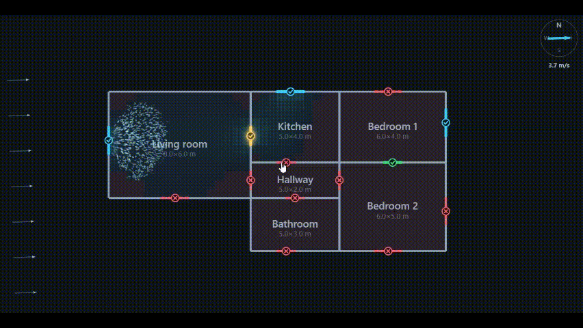
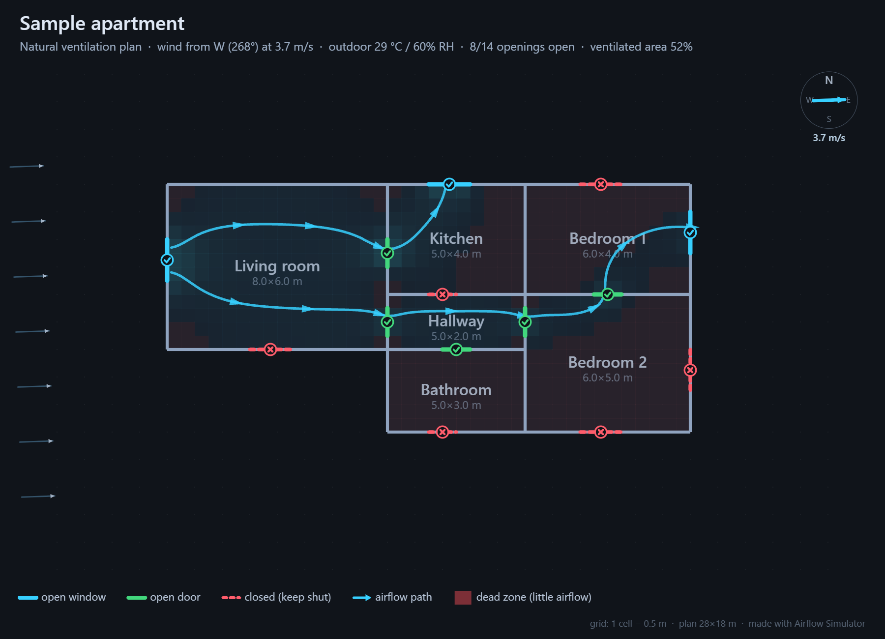

# 🌬️ Airflow Simulator

Interactive web app to **simulate natural cross-ventilation**. Draw rooms, place windows and doors, set the wind, watch particles flow, and find openings that keep air moving through the plan.

Static app — no backend. Plans autosave to `localStorage` and export/import as JSON.

**Live:** [airflowsimulator.netlify.app](https://airflowsimulator.netlify.app/)

[](https://app.netlify.com/projects/airflowsimulator/deploys)



## Features

- **Floor-plan editor** — grid rooms (1 cell = 0.5 m, plan 28×18 m), windows/doors on any wall, scale bar, W×L metre inputs, sample plan, erase/rename
- **Select & edit** — click room to select (yellow); drag interior to move, drag wall to resize. Click opening to open (**green**) / close (**red**); hold ~0.2 s to select (yellow ring) and drag along walls. Colour key bottom-right
- **Live airflow** — pressure-network solver + wind particles; dead zones tinted red; instant re-solve on edits
- **Best configuration** — searches open/closed sets to maximize ventilated floor area (🔒 locks openings)
- **Weather** — [Open-Meteo](https://open-meteo.com) via geolocation or town search (no API key; HTTPS/localhost for GPS)
- **Climate views** — Airflow / Temp / Humidity at the top of the sidebar; outdoor air advects through inlets; Environment baselines in a collapsible panel
- **Sidebar** — Simulation → Wind & weather → Environment (collapsed) → Floorplan (collapsed) → Save & export
- **Export** — PNG (streamlines, markers, legend) and JSON backup under **Save & export**
- **Mobile** — full-screen canvas; **Controls** bottom sheet for the same sidebar sections



## Run locally

```bash
npm install
npm run dev      # http://localhost:5173
npm run build    # type-check + dist/
npm run preview
```

Fully static — open `dist/index.html` directly, or host `dist/` (Netlify: build `npm run build`, publish `dist`; `netlify.toml` included).

## Limits

2-D steady potential-flow approx (not CFD) — compares configurations and stagnant zones, not absolute air speeds. Climate is a comfort visualisation (advected scalars), not full building physics.
